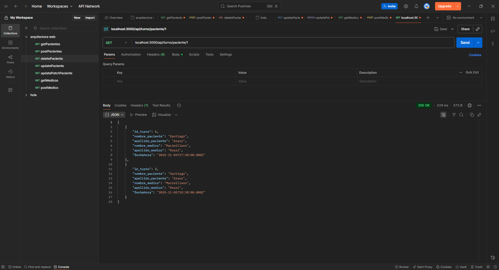
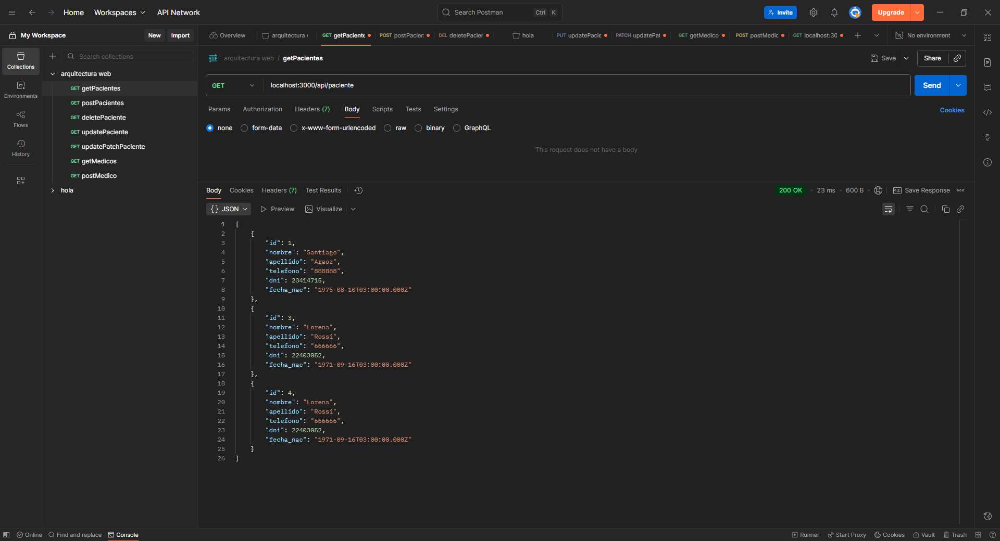
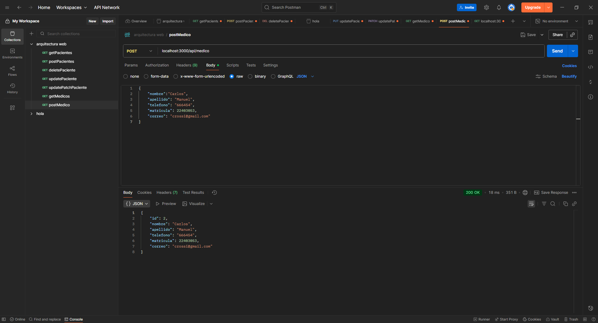
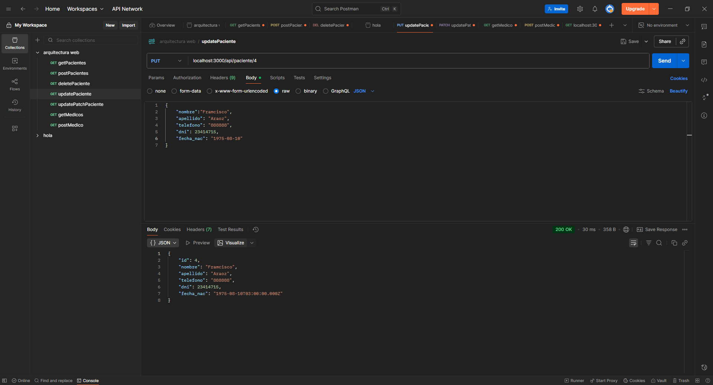
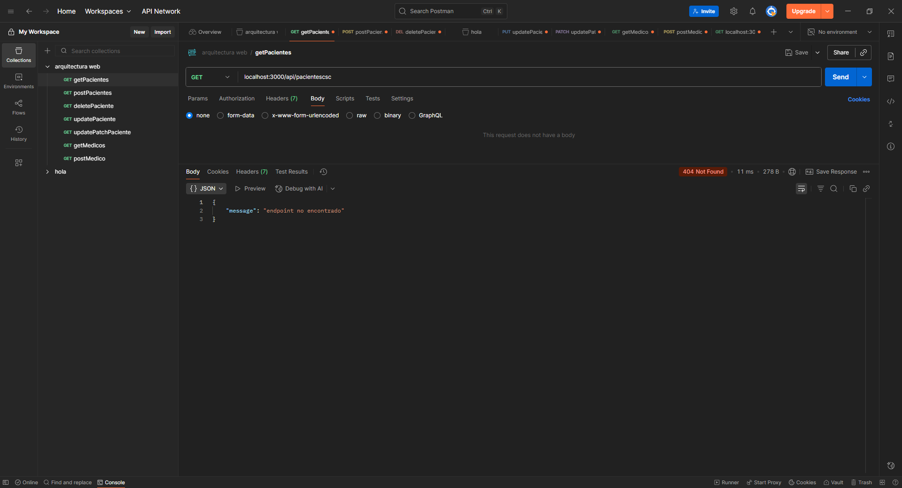

# TurneraMedicaWeb
version web del proyecto de LAB1
puerto para express 3000 y puerto para sql 3306
CABE ACLARAR QUE DEBERIA PASAR POR VARIABLES DE ENTORNO los valores de `db.js` pero a modo de prueba los dejo
NO SE DEBE HACER ES PELIGROSO

## Indice
* Medico
* paciente
* Turno
  

## Rutas
Todas las rutas deben empezar por 
`/api`
haciendo que quede
`localhost:3000/api/ruta`
una ruta que me gustaria destacar es
`get('/turno/paciente/:id', getTurnosPaciente)`
ya que permite mostrar los turnos de un paciente, faltaria hacer que se filtre por las pendientes.

tambien paso capturas de los distntos crud
* `get('/paciente', getPacientes)`

* `post('/medico', createMedico)`

* `put('/paciente/:id', updatePaciente)`

* hice un manejo de rutas errores para que no se caiga el servidor indicando que la ruta es erronea

## Paciente
clase para representar a los que van a ser atendidos
### Atributos
* id
* nombre
* apellido
* telefono
* dni
* fecha_nac
### Metodos
* `get('/paciente', getPacientes)`
* `get('/paciente/:id', getPaciente)`
* `post('/paciente', createPaciente)`
* `put('/paciente/:id', updatePaciente)`
* `patch('/paciente/:id', updatePatchPaciente)`
* `delete('/paciente/:id', deletePaciente)`

## Medico
clase para representar a los que van a atender personas
### atributos
* id
* nombre
* apellido
* telefono
* matricula
* correo
### metodos
* `get('/medico', getMedicos)`
* `get('/medico/:id', getMedico)`
* `post('/medico', createMedico)`
* `put('/medico/:id', updateMedico)`
* `patch('/medico/:id', updatePatchMedico)`
* `delete('/medico/:id', deleteMedico)`

## Turno
un turno necesita un paciente y un medico
### atributos
* id
* id_paciente
* id_medico
* fecha_Hora
### metodos
* `get('/turno', getTurnosAll)`
* `get('/turno/:id', getTurnoId)`
* `get('/turno/paciente/:id', getTurnosPaciente)`
* `post('/turno', createTurno)`
* `put('/turno/:id', updateTurno)`
* `patch('/turno/:id', updatePatchTurno)`
* `delete('/turno/:id', deleteTurno)`

## SQL
deje en la carpeta DB los ddl para crear las tablas y tambien para ya cargar datos.